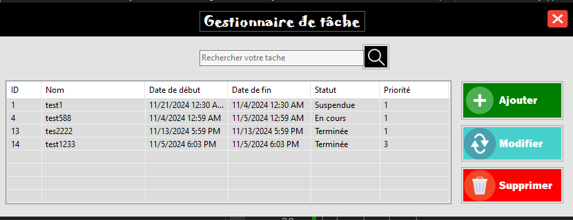
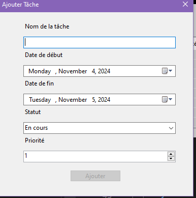

# MyAppTodo

MyAppTodo est une application simple et efficace de gestion de tâches qui permet aux utilisateurs de mieux organiser leur travail. L'application propose une interface intuitive pour créer, mettre à jour et supprimer des tâches, tout en permettant de définir des priorités et des échéances.

## Fonctionnalités

- **Ajouter des tâches** : Ajoutez facilement de nouvelles tâches avec un nom, une date de début, une date de fin, un statut et une priorité.  
- **Voir les tâches** : Consultez la liste des tâches avec tous les détails nécessaires.  
- **Modifier des tâches** : Mettez à jour les informations de vos tâches à tout moment.  
- **Supprimer des tâches** : Supprimez les tâches devenues inutiles.  
- **Recherche rapide** : Trouvez facilement des tâches en fonction de leur nom.  
- **Persistance des données** : Toutes les tâches sont stockées dans une base de données **SQLite**, garantissant la conservation des données même après la fermeture de l'application.  
- **Gestion des logs** : Utilisation de **NLog** pour enregistrer les actions et événements importants.  
- **Tests unitaires** : Utilisation de **xUnit** pour garantir la stabilité et la fiabilité du code.  

## Technologies utilisées

- **C#** : Langage de programmation principal utilisé pour développer l'application.  
- **Windows Forms** : Interface graphique (GUI) pour une interaction facile avec l'utilisateur.  
- **SQLite** : Système de gestion de base de données utilisé pour stocker les tâches.  
- **NLog** : Outil de journalisation pour suivre les événements et erreurs.  
- **xUnit** : Framework de tests unitaires pour assurer la qualité du code.  

## Prérequis

- [**.NET Framework**](https://dotnet.microsoft.com/download) - Assurez-vous d'avoir la dernière version installée.  
- **Bibliothèque SQLite pour .NET**.  
- **Bibliothèque NLog pour la gestion des logs**.  
- **xUnit pour les tests unitaires**.  

## Captures d'écran

### Interface principale  
  

### Fenêtre d'ajout de tâche  
  
